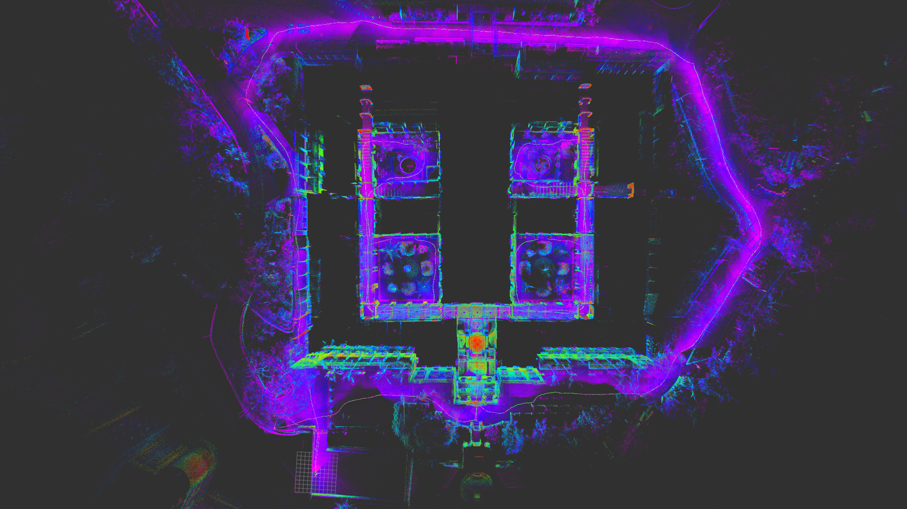
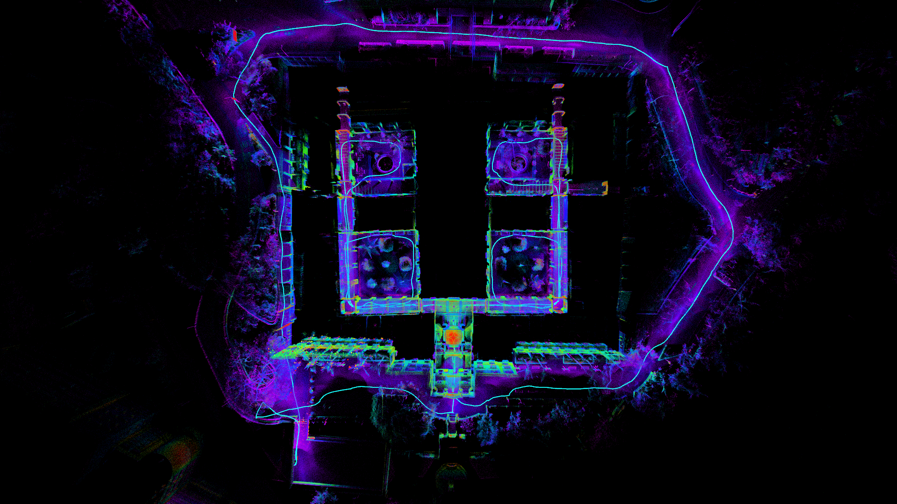

# Simple-LIO

## Done

- [x] 初始化零偏和P阵
- [x] IMU前向机械编排和噪声传播
- [x] 点云运动补偿

- [x] 迭代卡尔曼更新
  - [x] 构造观测矩阵
  - [x] 计算卡尔曼增益
  - [x] 计算误差状态
  - [x] 更新系统状态
- [x] 地图更新(使用ikd-tree)

## Todo

- [ ] 使用加速度计初始化横滚角和俯仰角
- [ ] 优化重力向量

## Result

|  |  |
| :---------------------------------: | :-----------------------------: |
|                this                 |            fast-lio             |

## How to use

下载

```bash
git clone https://gitee.com/ghowoght/simple_lio
```

更新依赖

```bash
cd simple_lio
git submodule update --init --recursive
```

编译

```bash
catkin_make
```

运行，需要自己准备数据集，输入为imu和点云数据，imu topic: /imu0, 点云topic: /livox/lidar

```bash
roslaunch simple_lio simple_lio.launch
```
